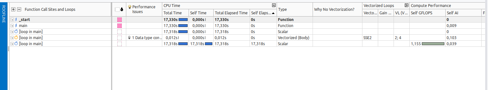

# Tarea 1: Intel Advisor

## Preguntas
* En la vista de "Survey & Roofline" se hace referencia a Total time y self-time. ¿Qué diferencia hay entre ambas?

### Diferencia entre Total time y Self-time

Total time: tiempo que tarda una función o bucle en ejecutarse, incluyendo el tiempo de ejecución de todas las funciones y bucles que llama.  
Self-time: tiempo que tarda una función o bucle en ejecutarse, excluyendo el tiempo de ejecución de las funciones y bucles que llama.

La diferencia entre ambos es que el tiempo total incluye el tiempo de ejecución de todos los subprocesos, mientras que el tiempo de autoejecución no. Esto significa que el tiempo de autoejecución siempre será menor o igual que el tiempo total.

* Realiza un análisis de tipo Survey, accede a  la pestaña "Survey & Roofline" y haz una captura de la información (se usará más tarde).

* Pulsa sobre roofline (dentro de Survey & Roofline) y comprueba que no aparece ningún gráfico. ¿A qué se debe?
* Haz un análisis de trip-counts y flop. ¿Qué información nueva aparece en la vista de survey? Haz una captura y comenta
los datos nuevos más relevantes.
