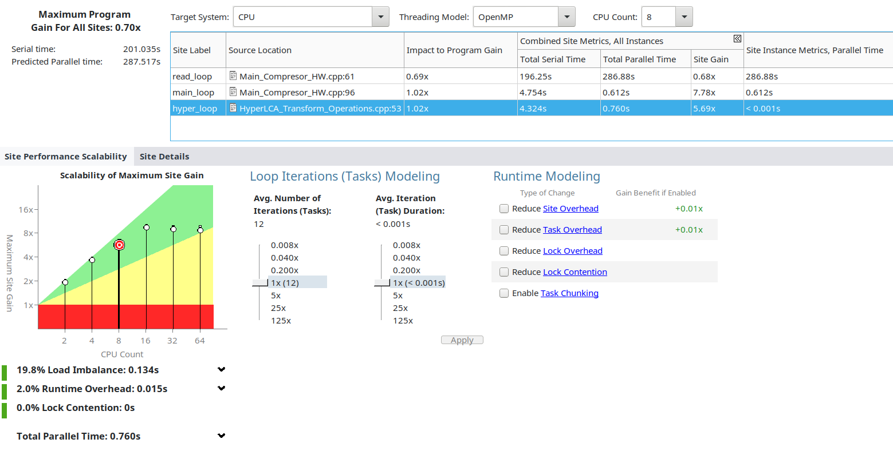

# Conceptos previos

A continuación, vamos a explicar los siguientes conceptos para poder entender mejor el análisis de threading:
- Gráfico Scalability of Maximum Site Gain
- Avg. Number of Iterations
- Avg. Iteration Duration
- Impact to Program Gain
- Combined Site Metrics, All Instances
- Site Instance Metrics, Parallel Time

Scalability of Maximum Site Gain es un gráfico que nos muestra cómo escala el rendimiento de una anotación concreta a medida que aumenta el número de CPUs lógicas utilizadas. Permite evaluar la eficiencia de la paralelización en nuestro código. 
El eje X representa el número de CPUs y el eje Y representa la ganancia de rendimiento. Cada punto representa una predicción de rendimiento para un número determinado de CPUs. Añade una diana al número de CPUs seleccionado en la sección CPU Count. Presenta 3 zonas de colores distintos:
1. Zona roja: Si el punto se encuentra en esta zona, está empeorando el rendimiento. 
2. Zona amarilla: Si el punto se encuentra en esta, estamos obteniendo una mejora sobre la ejecución, pero la escalabilidad todavía es pobre.
3. Zona verde: Si el punto está en esta zona, estamos obteniendo una mejora sobre la ejecución, está escalando bien,lo que significa que estamos haciendo un buen uso de los recursos de la CPU. Por lo tanto, cuanto más cerca esté el punto de la zona verde, mejor será la escalabilidad.

Al lado del gráfico, podemos observar unos controles deslizantes que nos permiten experimentar con diferentes iteraciones y duraciones. 
- Avg. Number of Iterations se refiere al número promedio de iteraciones que se realizan en una sección de código. Ajustar este valor nos permitiría ver cómo cambiaría el rendimiento si el número de iteraciones en esta sección fuese distinto.
- Avg. Iteration Duration se refiere al tiempo promedio que toma completar una iteración en una sección de código. Ajustar este valor nos permitiría ver cómo cambiaría el rendimiento si cada iteración tardara más o menos tiempo.
Por ejemplo, podriamos desenrollar nuestro bucle de modo que cada iteración tardara 5 veces más pero abría un número inferior de ellas.

Impact to Program Gain muestra como cada sección contribuye a la ganancia máxima del programa. Si una sección tiene un alto "Impact to Program Gain", significa que optimizar esta podría tener un gran impacto en el rendimiento general del programa. En caso contrario, si una sección tiene un bajo "Impact to Program Gain", puede que no valga la pena invertir mucho tiempo en optimizarla.

Combined Site Metrics, All Instances muestra los datos para todas las instancias de una sección en específico.
- Total Serial Time, tiempo total de serie para todas las instancias. 
- Total Parallel Time, tiempo total paralelo para todas las instancias. 
- Site Gain, ganancia de rendimiento máxima prevista total para todas las instancias. Es la diferencia entre el tiempo de serie y el tiempo paralelo.

Site Instance Metrics, Parallel Time muestra datos de instancias de una sección en concreto: número total de instancias de una sección y sus tiempos.
- Average Serial Time, tiempo de serie promedio. Se calcula de la siguiente forma: tiempo de serie total/número de instancias
- Average Parallel Time, tiempo paralelo promedio. Se calcula de la siguiente forma: tiempo paralelo total/número de instancias
- Number of Instances, número de instancias de la sección. Cuantas instancias se ejecutan en esta sección.

# Problemas detectados

Los sitios a analizar dados generan una advertencia indicando que son demasiado detallados.
Se indica que consideremos vectorización para estos, cosa que también se había previsto en la tarea 1.

Para tener más información, seleccionaremos otros sitos de grano mayor:

1. Principal: Main\_Compresor\_HW.cpp: 93 a 120.
2. Lectura de datos: Main\_Compresor\_HW.cpp: 62 a 67.
3. Hyper: HyperLCA\_Transform\_Operations.cpp: 54 a 81.

Al hacer el snapshot, el threading model se guarda como "otro" en vez de OpenMP, esto altera el gráfico y datos.
Se ha creado una captura de pantalla con los resultados originales:

# Analisis de escalabilidad

Como se había previsto en la tarea 1, el bucle de la lectura de datos empeora el tiempo si se paraleliza.
Ya se dio una breve explicación de porqué, por lo que no repetiremos esta.
Pero este análisis ha ayudado a confirmar que era así.

Para los otros dos bucles, podemos ver una muy buena mejora, sobre todo en el principal.
En cambio, para el bucle de la función Hyper\_LCA\_transform
